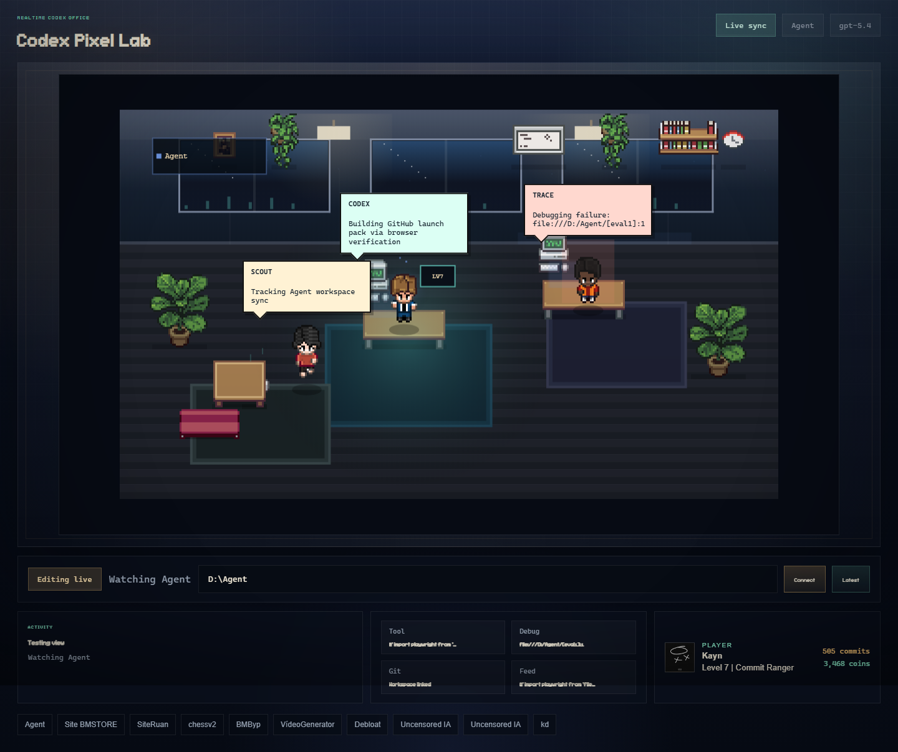

# Codex Pixel Lab

Codex Pixel Lab is a real-time pixel office for Codex Desktop.

It watches local Codex session transcripts, turns active work into live in-world agents, and frames software development as a cozy, playful, progression-driven dev RPG.



## Why this exists

Most AI coding interfaces still feel like logs, terminals, and status text.
Codex Pixel Lab explores a different direction:

- make the AI workflow visible
- make the current project feel alive
- turn debugging, coding, and iteration into a readable scene
- give developers identity, progression, and a room that evolves with their work

The goal is not a novelty dashboard.
The goal is a small product loop that feels fun enough to revisit and expressive enough to share.

## Documentation map

- [Architecture](docs/ARCHITECTURE.md)
- [Progression system](docs/PROGRESSION.md)
- [Agent roles and bubble behavior](docs/AGENTS.md)
- [Roadmap](docs/ROADMAP.md)

## Core idea

The system maps a live Codex session into a pixel world:

- `Codex` acts as the builder and reflects active implementation work
- `Trace` acts as the debugger and focuses on command output, checks, and failures
- `Scout` acts as the watcher and tracks project state, git cleanliness, and workspace context

Each agent speaks in short, useful status bubbles.
The office reacts to runtime state, player level, and unlocks.

## Product pillars

### 1. Live development scene

The office is synced to the project currently being worked on in Codex.

- latest matching session is resolved from local Codex transcript files
- shell commands, commentary, and runtime state feed the scene
- characters move, react, and expose meaningful status in-world

### 2. Developer identity

The player profile is linked to GitHub through the local `gh` CLI.

- commit count becomes progression XP
- levels unlock scenes, titles, and upgrades
- clicking an in-world character opens a full player profile

### 3. Dev RPG progression

The intended long-term loop is:

1. work in Codex
2. gain progression from real output and commits
3. unlock titles, scenarios, hardware, and agents
4. spend coins to evolve the office
5. build a room worth showing to other developers

## Current feature set

- real-time Codex transcript bridge
- project-to-session matching by workspace path
- pixel office rendered on a single canvas
- agent bubbles with role-aware status text
- bottom rail with activity, tool, debug, git, and feed summaries
- GitHub-backed player profile and commit-based level
- interactive character click targets with profile modal
- reactive room lighting, richer idle motion, and visual status effects
- unlockable themes, coins, office upgrades, and character-facing progression UI

## Progression model

The current progression loop is intentionally lightweight but extensible:

- player level is derived from GitHub commit history
- titles unlock at milestone levels
- scenes unlock automatically as level increases
- coins are derived from commits, repositories, followers, and level
- upgrades are designed to be persistent and office-facing

Examples of unlock categories:

- new room scenes
- improved desk rigs
- upgraded helper agents
- ambient and decorative office perks

See [docs/PROGRESSION.md](docs/PROGRESSION.md) for the full structure and future direction.

## Architecture

The app is intentionally simple:

- `server/` reads local Codex transcript JSONL files and exposes a WebSocket + HTTP bridge
- `public/` renders the office, player profile, and progression UI in the browser
- GitHub profile data is fetched from the local authenticated `gh` CLI session

See [docs/ARCHITECTURE.md](docs/ARCHITECTURE.md) for a deeper breakdown.

## Product direction

This project is trying to answer one product question:

What if your coding assistant felt less like a terminal transcript and more like a living room that reveals what the system is doing?

That means balancing two things at the same time:

- utility: the scene has to communicate real work state
- delight: the room has to feel expressive enough that developers want to keep it open

## Local development

### Requirements

- Node.js
- Codex Desktop installed locally
- `gh auth login` completed if you want player progression from GitHub

### Run

```bash
npm install
npm run dev
```

Open [http://localhost:3000](http://localhost:3000).

### Connect a workspace

1. Open the app.
2. Paste the project path you are currently using in Codex.
3. Click `Connect`, or use `Latest`.

The bridge finds the latest Codex transcript whose `cwd` matches that project and starts streaming it into the office.

## Repo roadmap

### Near-term

- full RPG economy with persistent office upgrades
- scene selection, inventory, and cosmetic loadouts
- better progression UX for titles and unlocks
- improved agent-specific role logic and accessory upgrades

### Mid-term

- sharing and recording office states
- snapshots of sessions and project milestones
- support for more IDEs and coding agents
- richer event system tied to builds, tests, and releases

### Long-term

- social layer and public profiles
- collectible office items and seasonal events
- shared co-working rooms for teams

See [docs/ROADMAP.md](docs/ROADMAP.md) for the phased direction.

## Why this could be shareable

Developer tools go further when they communicate identity, progress, and story.

Codex Pixel Lab has a shot at becoming sticky because it combines:

- visible live utility
- game-like progression
- a room that changes over time
- a profile that says something about the developer behind the work

The most important part is maintaining utility while making the experience feel delightful.

## License

MIT
