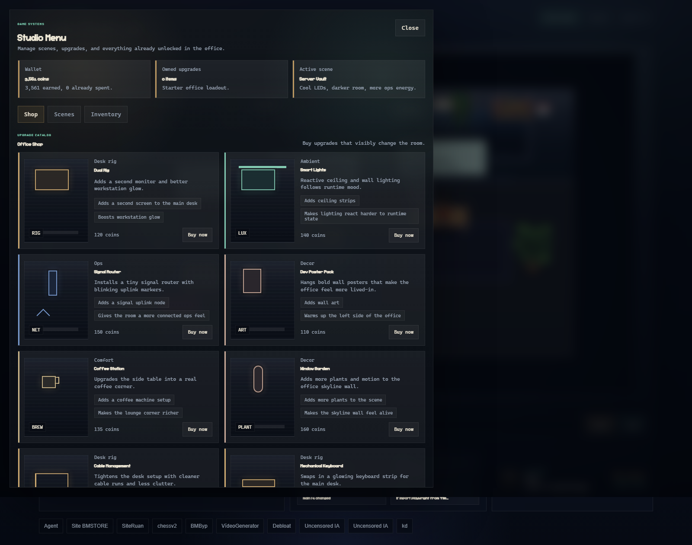

# Pixel Lab (Antigravity Edition)

Pixel Lab is a real-time pixel office for VS Code and Antigravity agents.

It watches your local terminal and IDE activity, turning active work into live in-world agents, and frames software development as a cozy, playful dev RPG.

### 🚀 Now with VS Code Extension

Pixel Lab is now fully integrated into VS Code, allowing you to watch your agents directly from your sidebar or a dedicated center panel.

## Why this exists

Most AI coding interfaces still feel like logs, terminals, and status text.
Pixel Lab explores a different direction:

- make the AI workflow visible
- make the current project feel alive
- turn debugging, coding, and iteration into a readable scene
- give developers a visual representation of their AI workflow

The goal is not a novelty dashboard.
The goal is a small product loop that feels fun enough to revisit and expressive enough to share.

## Documentation map

- [Architecture](docs/ARCHITECTURE.md)
- [Progression system](docs/PROGRESSION.md)
- [Agent roles and bubble behavior](docs/AGENTS.md)
- [Roadmap](docs/ROADMAP.md)

## Core idea

The system maps a live Gemini session into a pixel world:

- The Main Agent acts as the builder and reflects active implementation work
- Drones/Sub-Agents act as watchers and debuggers, tracking project state and working in the background

Each agent speaks in short, useful status bubbles.
The office reacts to runtime state, file reads, and tool execution.

## Product pillars

### 1. Live development scene

The office is synced to your current VS Code workspace.

- Shell commands, terminal output, and runtime state feed the scene
- Characters move, react, and expose meaningful status in-world
- **Gemini Integration**: 100% synchronization with Gemini terminals, spawning character actions in real-time.
- **Antigravity Adapter**: Enhanced animations for thinking, coding, reading files, and resolving errors.

### 2. Developer progression

- Work in your IDE and watch your office evolve
- Unlock new desks and upgrades as your agents process more tasks

### 3. Dev RPG progression

The intended long-term loop is:

1. Work with your Gemini agents
2. Gain progression from real output and tool usage
3. Unlock scenarios, hardware, and agent desks
4. Build a room worth showing to other developers

## Current feature set

- **VS Code Integration**: Native sidebar and central panel support for a fully integrated experience.
- **Real-time Gemini Sync**: 1:1 synchronization with Gemini terminal sessions.
- **Antigravity Adapter**: Enhanced support for Antigravity agents with idle, thinking, and celebration animations.
- **Clean Room Interface**: A perfectly synchronized office environment that reflects your active workspace.
- Pixel office rendered on a single canvas
- Agent bubbles with role-aware status text
- Bottom rail with activity and tool summaries
- Interactive character click targets
- Reactive room lighting, richer idle motion, and visual status effects
- Unlockable aesthetic upgrades

## Progression model

The current progression loop is intentionally lightweight but extensible:

- player level is derived from GitHub commit history
- titles unlock at milestone levels
- scenes unlock automatically as level increases
- coins are derived from commits, repositories, followers, and level
- upgrades are designed to be persistent and office-facing

Examples of unlock categories:

- new room scenes
- improved desk rigs
- upgraded helper agents
- ambient and decorative office perks

See [docs/PROGRESSION.md](docs/PROGRESSION.md) for the full structure and future direction.

## Architecture

The extension uses two main components:

- **VS Code Webview**: Renders the HTML/Canvas isometric office directly in your IDE.
- **Node.js Bridge**: Communicates with the terminal, intercepting tool executions, reads, and agent lifecycles via the Antigravity adapter.

## Product direction

This project is trying to answer one product question:

What if your coding assistant felt less like a terminal transcript and more like a living room that reveals what the system is doing?

That means balancing two things at the same time:

- utility: the scene has to communicate real work state
- delight: the room has to feel expressive enough that developers want to keep it open

## 🛠️ Instalação e Uso (VS Code Extension)

O Pixel Lab agora funciona exclusivamente como uma extensão do VS Code para garantir total integração com seus terminais Gemini.

### Pré-requisitos

- **VS Code**: Versão 1.85.0 ou superior.
- **Node.js**: Para o build inicial (opcional se você já tiver o `.vsix`).
- **Codex Desktop**: Instalado e rodando localmente.

### Como Rodar

1.  **Clone o repositório**: `git clone https://github.com/Caionickpi/codex-pixel-lab.git`
2.  **Acesse a pasta da extensão**: `cd extension`
3.  **Instale as dependências**: `npm install`
4.  **Gere o pacote**: `npm run package` (Isso criará um arquivo `.vsix`).
5.  **Instale no VS Code**:
    - Vá na aba de extensões (`Ctrl+Shift+X`).
    - Clique nos três pontos (`...`) no canto superior direito.
    - Selecione "Install from VSIX..." e escolha o arquivo gerado.

### Como Usar

1. Abra o Pixel Lab clicando no ícone do controle na barra lateral esquerda ou pelo comando `Pixel Lab: Abrir Pixel Lab`.
2. Clique em **Conectar Workspace** para sincronizar com seu projeto atual.
3. Abra um terminal e digite `gemini` para ver seus agentes ganharem vida no escritório!

> [!TIP]
> Você pode abrir o Pixel Lab tanto na barra lateral (Sidebar) quanto em um painel central maior para uma visão mais detalhada.

## Repo roadmap

### Near-term

- full RPG economy with persistent office upgrades
- scene selection, inventory, and cosmetic loadouts
- better progression UX for titles and unlocks
- improved agent-specific role logic and accessory upgrades

### Mid-term

- sharing and recording office states
- snapshots of sessions and project milestones
- support for more IDEs and coding agents
- richer event system tied to builds, tests, and releases

### Long-term

- social layer and public profiles
- collectible office items and seasonal events
- shared co-working rooms for teams

See [docs/ROADMAP.md](docs/ROADMAP.md) for the phased direction.

## Why this could be shareable

Developer tools go further when they communicate identity, progress, and story.

Pixel Lab has a shot at becoming sticky because it combines:

- visible live utility
- game-like progression
- a room that changes over time
- a profile that says something about the developer behind the work

The most important part is maintaining utility while making the experience feel delightful.

## License

MIT
