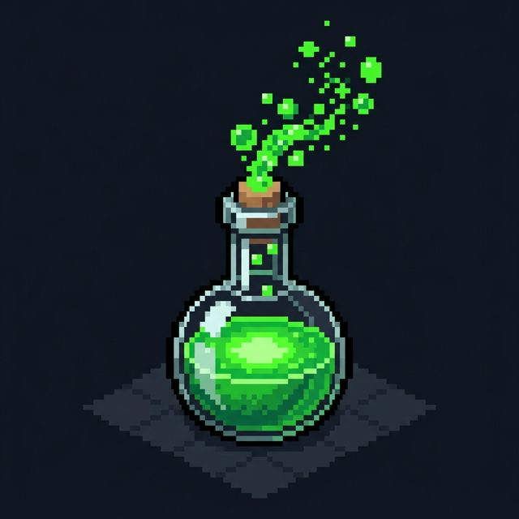

  
  <h1>Pixel Lab (Antigravity Agent)</h1>

  
<b>Seu próprio escritório de IA em Pixel Art</b>

---

**Pixel Lab** é uma extensão projetada para visualizar o trabalho do seu agente autônomo. Em vez de ficar olhando apenas para um terminal ou painel estático, você assiste a um escritório isométrico charmoso onde seus agentes (terminais ativos do Gemini) ganham vida no VS Code!

## 🚀 Funcionalidades Mágicas

- **Sincronia 100% Real-Time**: Cada terminal com o nome "Gemini" ou "Agent" aberto no seu editor vira um boneco físico passeando pelo escritório. Feche o console, e eles batem o ponto e vão embora!
- **Integração + Agent**: Abra instantaneamente novos assistentes do Gemini direto pela barra de ferramentas.
- **+ Sub-Agent (Helper Stealth)**: Inicie sub-agentes furtivos que analisam o código do projeto em background e aplicam correções sem obstruir a sua view com terminais novos. Eles assumem a forma de "Drones" ou "Helpers" (`char_5`) e ficam de olho usando sua visão raio-X.
- **Sistema de Upgrades Artísticos**: A sala muda conforme sua experiência! Mais agentes = mesas novas habilitadas no código interno (`desk4`, `desk5`), layout imune a quebras CSS, telas ultrawide e refrigeramento líquido.
- **Feedback de Ação Visual**: Os personagens param, rodam código, investigam livros (quando rodando `read_file` ou `grep`), ou ficam vermelhos quando a ferramenta der erro. As falas no console aparecem em balões!

## 🎮 Como Usar

1. Depois de instalar, clique no ícone do **Pixel Lab** na barra lateral.
2. Aguarde o **Bridge** mapear o seu Workspace autônonomo.
3. Clique em **`+ Agent`** para abrir o terminal principal do Gemini. Você verá o avatar principal dele indo pro escritório!
4. Para chamar supervisão de background e correção paralela dos seus bugs, instancie Drones autônomos com o botão **`+ Sub-Agent`**.

---

_Construído dentro da iniciativa Antigravity da Google DeepMind Team._
